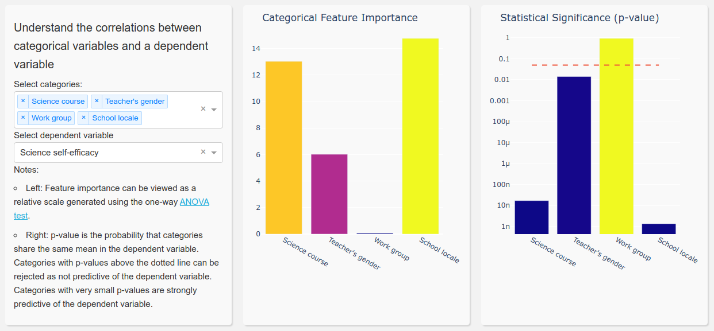
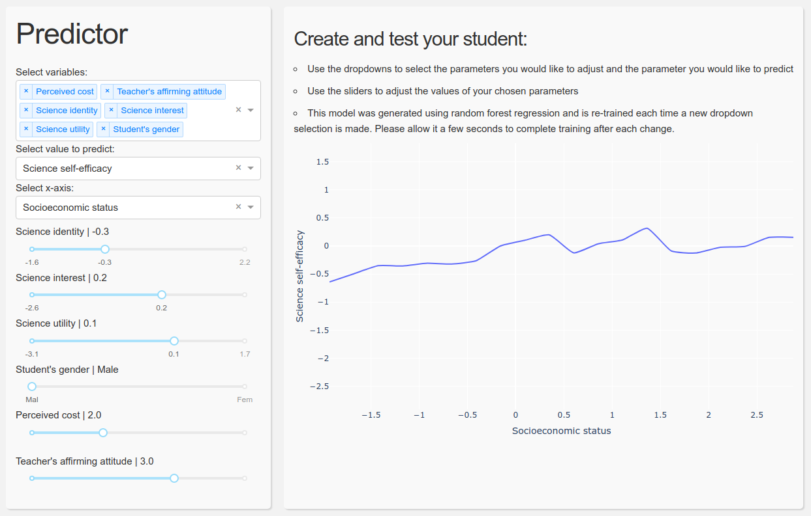

# Science Sel-efficacy Dashboard
Tool to analyze the High School Longitudinal Study of 2009 (HSLS:09) dataset
## Authors: Ian Pegg, Subrato Chakravorty, Yan Sun, Daniel You, Heqian Lu, Kai Wang

Example of our tool for exploring feature importance



Our more sophisticated tool that uses random forest to predict student behavior based on user-selectable inputs.



## Installation

A conda environment is recommended, otherwise Node.js must be installed separately.

```
conda env create
```

## Usage

```
python -m src
```

## Testing

run `pytest --headless` in the top directory.

### Testing dependencies 

Python:
- dash[testing]
- selenium
- pytest

Other:
- [chromedriver](http://chromedriver.chromium.org/getting-started)
- [google-chrome](https://www.google.com/chrome/)
